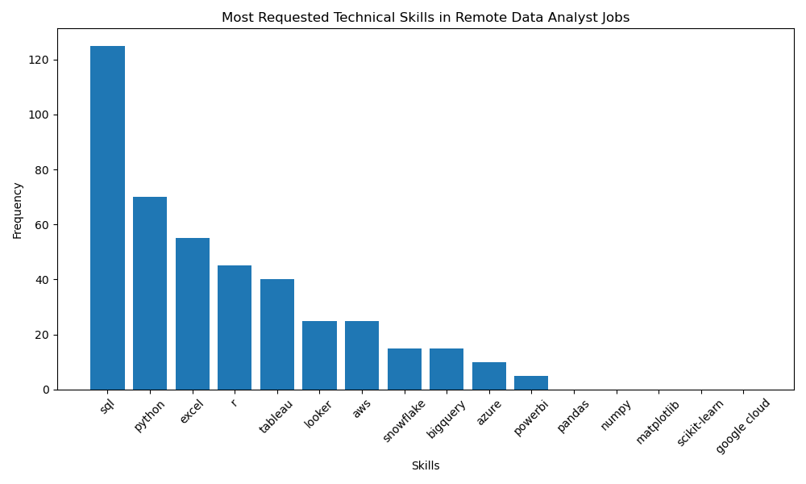

# Data Analyst Job Market Analysis

> 📅 **Project Date:** May 2025

This project analyzes **remote Data Analyst job postings** to identify the most in-demand skills in today’s job market. It covers **web scraping**, **data cleaning**, **exploratory data analysis (EDA)**, and **data visualization** using Python.

---

## 📁 Folder Structure

```text
data_analyst_job_analysis/
├── data/
│   └── data_analyst_jobs.csv                # Scraped job data
├── scripts/
│   ├── scrape_remote_jobs.ipynb             # Web scraping notebook
│   ├── eda_description_wordcloud.ipynb      # EDA & WordCloud visualization
│   └── analyze_skills.ipynb                 # Technical skills analysis
├── visuals/
│   ├── top_skills_chart.png                 # Bar chart of top skills
│   └── job_description_wordcloud.png        # Word cloud from job descriptions
└── README.md                                # Project documentation (this file)
```

---

## 🎯 Project Goals

- ✅ Scrape remote job ads for "Data Analyst" roles.
- ✅ Extract job titles, links, and descriptions.
- ✅ Identify frequently mentioned technical skills.
- ✅ Visualize the results through bar charts and word clouds.

---

## 🛠️ Tools & Technologies

- Python
- Jupyter Notebook
- Libraries: `requests`, `BeautifulSoup`, `pandas`, `matplotlib`, `wordcloud`
- Environment: VS Code / JupyterLab

---

## 📊 Process Overview

### 1. Web Scraping
Collected **100 remote Data Analyst jobs** from [RemoteRocketship](https://remoterocketship.com), stored in `data/data_analyst_jobs.csv`.

### 2. Skill Extraction
Parsed descriptions to count mentions of tools like `SQL`, `Python`, `Excel`, `Tableau`, `R`, etc.

### 3. Visualizations
- `top_skills_chart.png` → Frequency of top technical skills  
- `job_description_wordcloud.png` → Word cloud of most common job description terms

---

## 📈 Sample Visuals

### 🔧 Top Technical Skills  


### ☁️ WordCloud  


---

## 🚀 How to Run This Project

```bash
# 1. Clone the repository
git clone https://github.com/your-username/data_analyst_job_analysis.git

# 2. Move into the project directory
cd data_analyst_job_analysis

# 3. Install required Python libraries
pip install requests beautifulsoup4 pandas matplotlib wordcloud

# 4. Launch Jupyter Notebook or JupyterLab
jupyter notebook
# or
jupyter lab
```

Once Jupyter is open in your browser:

- Run `scripts/scrape_remote_jobs.ipynb` to scrape job data (optional if CSV already exists)
- Run `scripts/eda_description_wordcloud.ipynb` to explore job descriptions via WordCloud
- Run `scripts/analyze_skills.ipynb` to extract and visualize key technical skills

---

## 📬 Contact

If you'd like to get in touch or collaborate, feel free to reach out through the channels below:

- **GitHub:** [github.com/yavuzcancolak](https://github.com/yavuzcancolak)  
- **LinkedIn:** [linkedin.com/in/yavuzcan-colak](https://www.linkedin.com/in/yavuzcan-colak/)  
- **Email:** yavuz.colak@live.com


